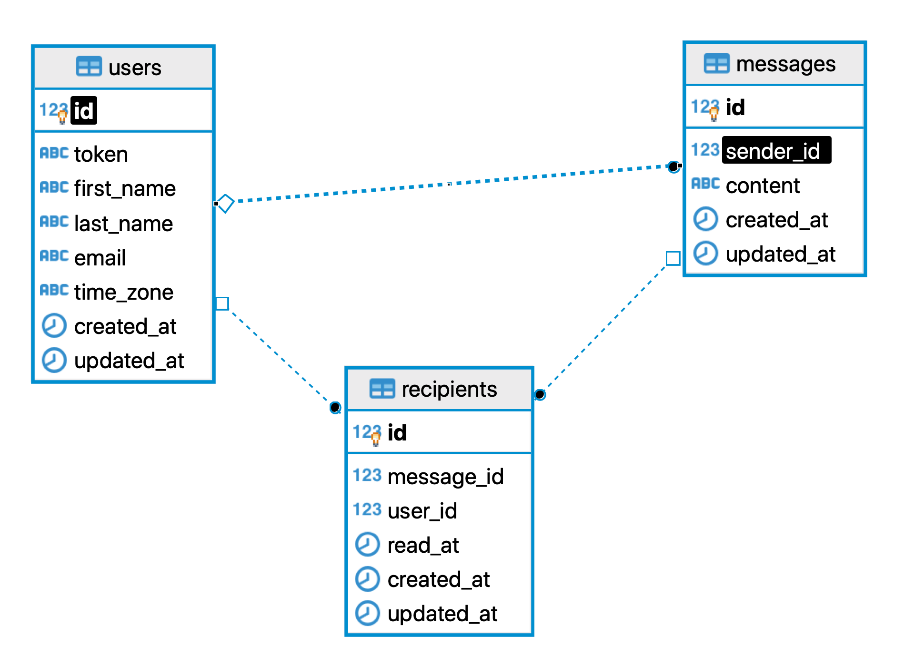

# Fyber Messaging

## Setup

### Build app image
```
docker-compose build
```

### Database
#### Run postgresql and redis
```
docker-compose up -d postgres redis
```

#### Prepare DB
##### Create database, run migrations and add seed entries.
```
docker-compose run fyber_messaging bundle exec rails db:setup
```

## Run app
```
docker-compose up
```

## Run tests
```
docker-compose run fyber_messaging bundle exec rspec
```

## DB Architecture

The Rails application has three models according to the following database schema.



Users - stores users info
```
token - access token for protected API endpoints
first_name, last_name, email - contact info
time_zone - valid time zone string
```
[Valid time zones](https://api.rubyonrails.org/classes/ActiveSupport/TimeZone.html)

Messages - stores sent messages.
```
sender_id - id of user sending the message
content - content of the message
```

Recipients - Users has and belongs to many Messages join table. Stores recipients of messages.
```
message_id - id of message
user_id - id of user receving the message
read_at - timestamp when recipient read the message
```

## Access API docs

#### URL
http://localhost:8080

## Access app

#### URL
http://localhost:3000

#### Headers
```
Authorization token_hash
Accept application/json
Content-Type application/json
```

#### Create users example
```
POST /users

Headers:
Accept application/json
Content-Type application/json

Body:
{
  "user": {
    "first_name": "John",
    "last_name": "Dow",
    "email": "john.dow@example.org",
    "time_zone": "America/New_York"
  }
}

Response:
{
  "id": 1,
  "token": "DsYKz9PWcB7deAufcQCi3AKqRy8",
  "first_name": "John",
  "last_name": "Dow",
  "email": "john.dow@example.org",
  "time_zone": "America/New_York"
}
```

#### Send message example
```
POST /messages

Headers:
Authorization DsYKz9PWcB7deAufcQCi3AKqRy8
Accept application/json
Content-Type application/json

Body:
{
  "message": {
    "user_ids": [2,3],
    "content": "lorem..."
  }
}

Response:
{
  "id": 1,
  "content": "lorem...",
  "sent_at": "2021-03-14T19:41:47.439-04:00",
  "read_at": null,
  "sender": {
    "id": 1,
    ...
  }
}
```

#### Read new messages example
```
GET /messages

Headers:
Authorization Token of recipient user with id 2
Accept application/json
Content-Type application/json

Response:
[
  {
    "id": 1,
    "content": "lorem...",
    "sent_at": "2021-03-14T19:41:47.439-07:00",
    "read_at": "2021-03-14T20:15:29.584-07:00",
    "sender": {
      "id": 1,
      ...
    }
  }
]
```

`sent_at` and `read_at` timestamps are formatted with time zone of the user reading the messages.

After read, messages are marked as read - second request will return empty data.

```
GET /messages

Headers:
Authorization Token of recipient user with id 2
Accept application/json
Content-Type application/json

Response:
[]
```

## Seed data

By default the DB has this seeded data:

#### Users
```
id: 1
token: token
first_name: 1
last_name: 1
email: 1@example.org
time_zone: Europe/Berlin
-------------------------------
id: 2
token: recipient_token2
first_name: 2
last_name: 2
email: 2@example.org
time_zone: America/New_York
-------------------------------
id: 3
token: recipient_token3
first_name: 3
last_name: 3
email: 3@example.org
time_zone: America/Los_Angeles
```

#### Messages
```
id: 1
sender_id: 1
content: recipient_user2
-------------------------------
id: 2
sender_id: 1
content: recipient_user3
-------------------------------
id: 3
sender_id: 1
content: recipient_user2 recipient_user3
```

#### Recipients
```
id: 1
message_id: 1
user_id: 2
-------------------------------
id: 2
message_id: 2
user_id: 3
-------------------------------
id: 3
message_id: 3
user_id: 2
-------------------------------
id: 4
message_id: 3
user_id: 3
```
